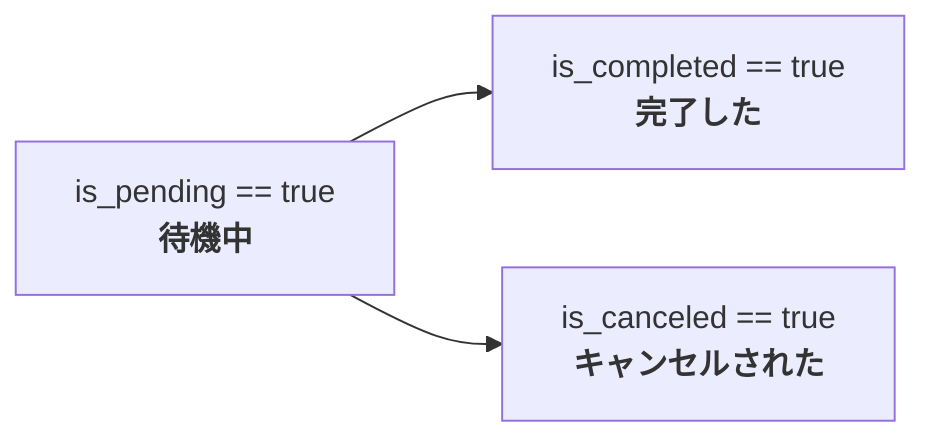
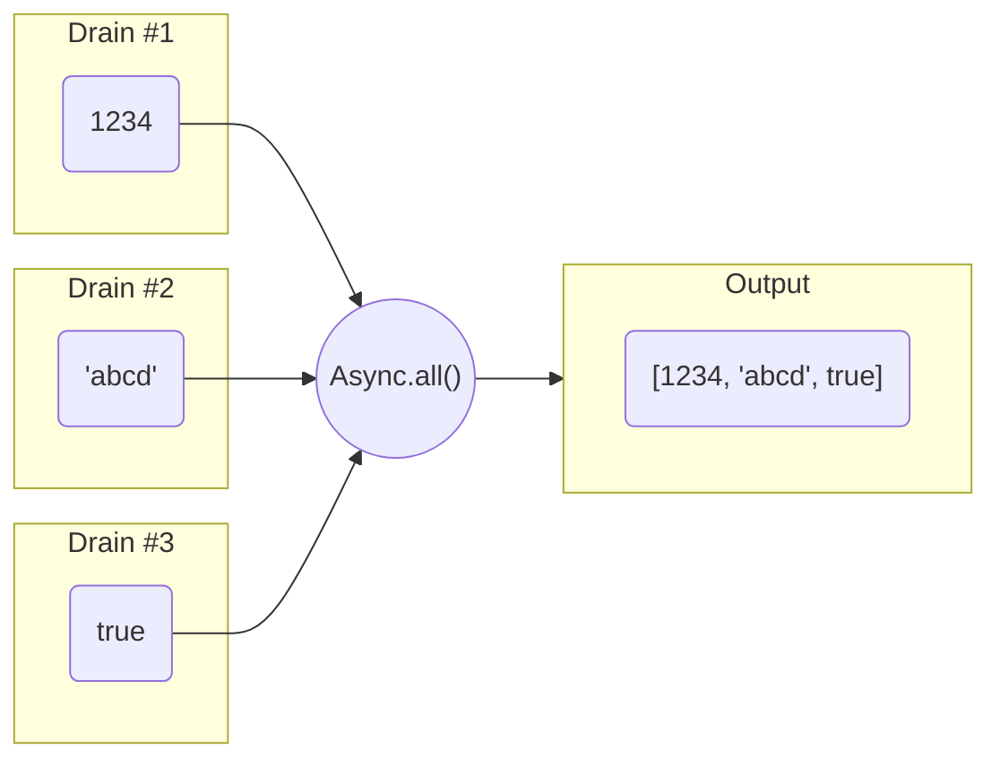
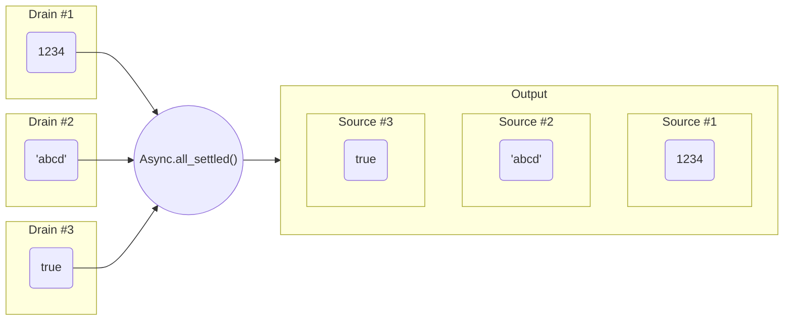
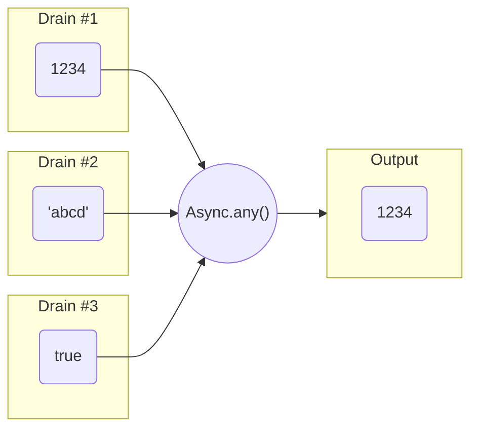
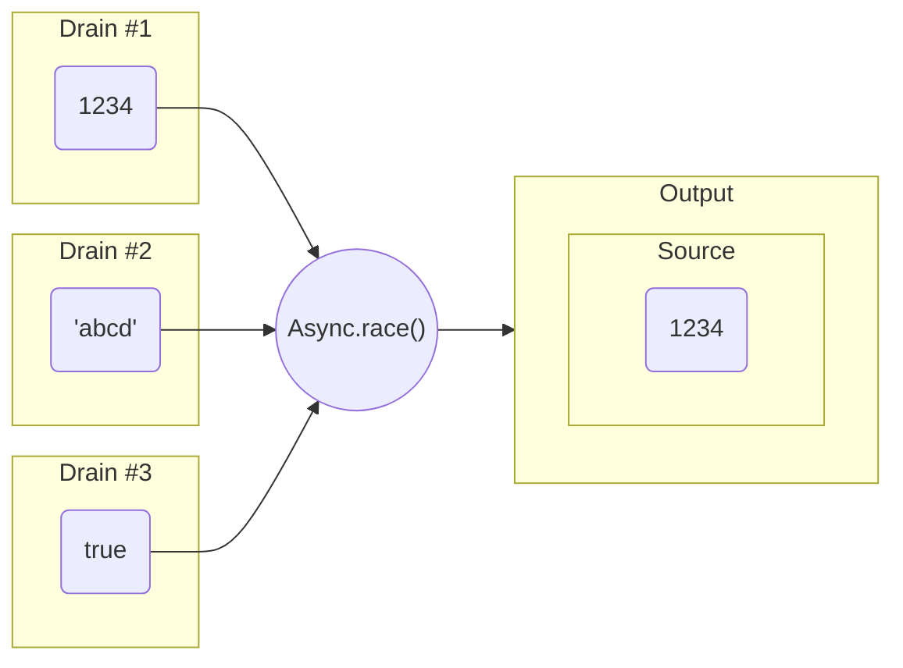

日本語

<br />

[](https://github.com/ydipeepo/godot-motion/blob/main/LICENSE.md)
[](https://twitter.com/ydipeepo)

<br />


<br />

# Nesinkrona

未来に確定する結果やシグナルを未定の段階から統一した単位にすることによりコードの取り回しをよくします。そのためのアドオンです。[Async Helper](https://github.com/ydipeepo/godot-async-helper) (Godot 3) の Godot 4 移植版。

<br />

* 実装が単純なので高速です
* await するその 1 段階前から単位にしますので、シグナルやコルーチンが入り組むコードを簡素化できます
* yield によるジェネレータ、イテレータを再現したパターンを含みます

<br />

---

<br />

## 準備

まだテスト段階のため、Godot AssetLib では配信されていません。

<br />

#### デモを確認したい

1. このリポジトリをクローンして Godot Engine で開きます
2. (`demos/Demo.tscn` をメインシーンに設定して、) F5

#### アドオンを導入したい

1. `addons/godot-nesink` ディレクトリを丸ごとプロジェクトに複製します
2. `Nesinkrona` アドオンを有効にします
3. 書く。

<br />

## Async

Async というクラスが非同期的な処理 (コルーチンもしくはシグナル) をラップし抽象化する役割を持っています。このクラスはこのアドオンの中心となり、いくつかのファクトリメソッドを持ちます。

<br />

```GDScript
signal my_signal

var a1 := Async.from_signal(my_signal)
var a2 := Async.from(func():
	var tween := create_tween()
	tween.tween_property($Button, "modulate", Color.WHITE)
	tween.play()
	await tween.finished)
var a3 := Async.delay(3.0)
await Async.wait_all([a1, a2, a3])
$Button.text = "Hi!"
```

<br />

このクラスは 1 つの非同期的な処理を抽象化し、その処理の状態と完了した場合は 1 つの結果を保持します。

<br />

#### 状態

Async クラスは `is_completed` プロパティ、`is_canceled` プロパティ、`is_pending` という 3 つのプロパティを持ち、そのプロパティが true を返すかにより 3 つの状態を表現します。



* **待機中**
  `is_pending == true and (is_completed == false and is_canceled == false)`
* **完了した**
  `is_completed == true and (is_pending == false and is_canceled == false)`
* **キャンセルされた**
  `is_canceled == true and (is_pending == false and is_completed == false)`

`is_completed` と `is_canceled`、`is_pending` は常に 1 つが true となります。2 つ以上が true になることはありません。


<br />


#### 結果

ファクトリメソッドから `Async` を作成した段階でまだ結果が決まっていないことがあります。これは、例えばシグナルを `Async` に変換した場合、シグナルを発火するまでその結果が分からないためです。`Async` クラスは `wait()` というメソッドを持ちそのメソッド呼び出しを await することにより結果を得ます。

```GDScript
# 何らかの GUI 入力があるまで結果がわからない
var async := Async.from_signal(self.gui_input, 1)
# GUI 入力があるまで待機
var event := await async.wait()
```

* `wait()` が返す結果は、一度完了すると変化することはありません。
* `wait()` を待機した後は、`is_completed` か `is_canceled` のどちらかが必ず true となりますが、待機前の状態は不定です。(待機前から完了もしくはキャンセルされていることがあります)
* キャンセルされた場合の戻り値は null となりますが、完了していても null を返す場合がありますので、キャンセルされる可能性がある場合は必ず `is_pending`、`is_completed` や `is_canceled` をチェックします。


<br />


#### 継続

何らかの `Async` が完了したあとその結果に続けて処理をさせたい場合は `wait()` メソッドを使い値を取り出す以外に、`then()` というメソッドを使い新たな `Async` にしてしまうことができます。

```GDScript
var async1 := Async.from_signal(self.gui_input, 1)

# GUI 入力があったとき、そのイベントを print
var async2 := async1.then(func(event): print(event))

# (必要があれば) async2 のように変数を保管しておき、待機することもできます
await async2.wait()
```


<br />


### いくつかの重要なメソッド

Async が公開する static なメソッドはすべて新たな Async を作成するためのものですが、その中でもいくつか重要なものがあります。


#### Async.all(drains: Array, cancel: Cancel = null) -> Async

すべての Drain の完了を待機し、その結果を配列に格納したものが結果となる `Async` を作成します。



* すべての入力が完了した場合にのみ Output の `is_completed` が true となります。
* 第二引数は Drain の `wait()` に対し与えられるものです。
* キャンセルされたとしても結果が必要な場合はこのメソッドではなく、`Async.all_settled()` を使います。


#### Async.all_settled(drains: Array, cancel: Cancel = null) -> Async

すべての Drain が完了もしくはキャンセルされるまで待機し、その結果を `Async` の配列としたものが結果となる `Async` を作成します。



* すべてがの Drain が完了もしくはキャンセルされた場合、Output の `is_completed` が true となります。
* 第二引数は Drain の `wait()` に対し与えられるものです。


#### Async.any(drains: Array, cancel: Cancel = null) -> Async

すべての Drain のうちどれか一つが完了するまで待機し、(その結果が) そのまま結果となる `Async` を作成します。



* Drain がすべてキャンセルされた場合、Output の `is_canceled` が true となります。
* 第二引数は Drain の `wait()` に対し与えられるものです。
* キャンセルされたとしても結果が必要な場合はこのメソッドではなく、`Async.race()` を使います。


#### Async.race(drains: Array, cancel: Cancel = null) -> Async

すべての Drain のうちどれか一つが完了もしくはキャンセルされるまで待機し、その結果を `Async` としたものが結果となる `Async` を作成します。



* Drain がすべてキャンセルされた場合でも、Output の `is_completed` は true となります。
* 第二引数は Drain の `wait()` に対し与えられるものです。


<br />


---


<br />


## バグの報告や要望など

バグの修正や報告、ドキュメント翻訳、およびその他の改善など歓迎いたします。

