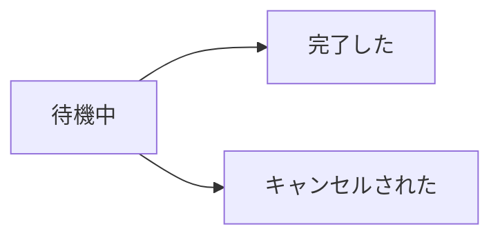
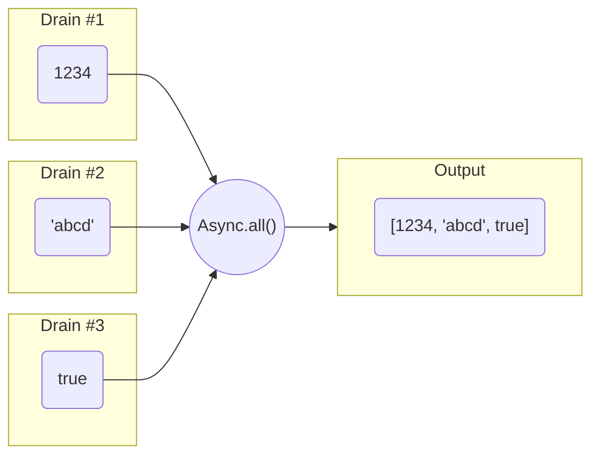
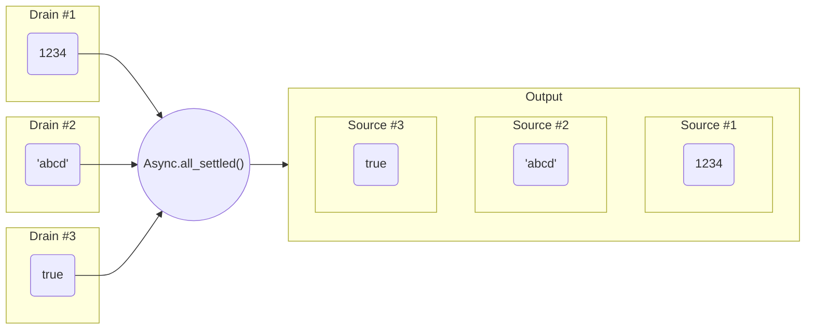
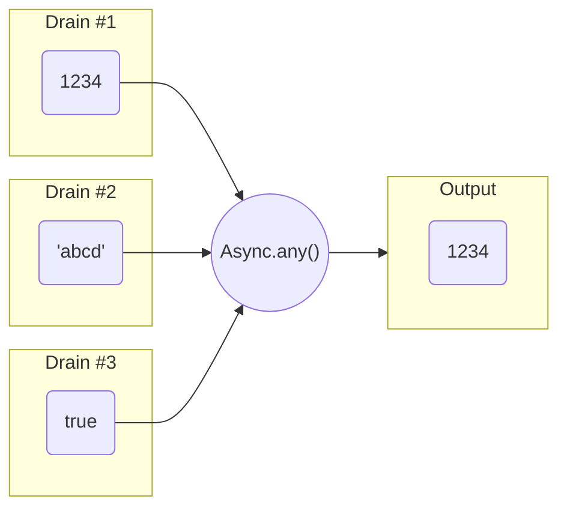
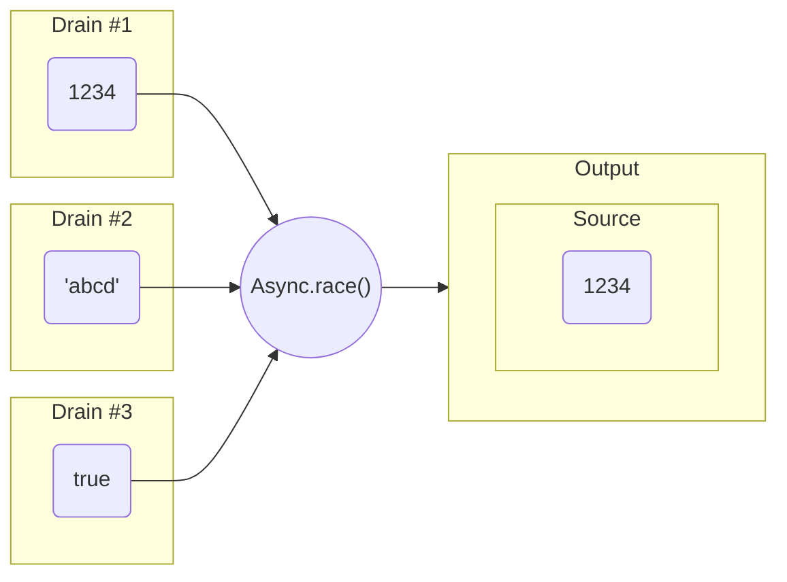

ドキュメント作成途中


# Nesinkrona

Godot 4 にシンプルな非同期パターンを追加するアドオンです。実装が単純なため高速に動作し、シグナルやコルーチンが入り組むコードを簡素化するのに役立ちます。廃止されてしまった yield によるジェネレータを、非同期パターンを用いて再現したパターンも含みます。


## Async クラス

非同期的な処理を抽象化し、その結果を保持するクラスです。またいくつかの重要なファクトリメソッドを公開します。


### 状態

このクラスは `is_completed` プロパティ、`is_canceled` プロパティという 2 つのプロパティを持ち、3 つの状態を表現します。



* **待機中**
  `is_completed == false and is_canceled == false`
* **完了した**
  `is_completed == true and is_canceled == false`
* **キャンセルされた**
  `is_completed == false and is_canceled == true`

なお、`is_completed` と `is_canceled` が両方とも true になることは決してありません。


### 結果

ファクトリメソッドから `Async` を作成した段階では、結果が決まっていないことがあります。これは、例えばシグナルを `Async` に変換した場合、シグナルを発火するまでその結果が分からないためです。そのため、`Async` クラスは `wait()` というメソッドを持ちます。

```GDScript
# 何らかの GUI 入力があるまで結果がわからない
var async := Async.from_signal(self.gui_input, 1)

# GUI 入力があるまで待機
var event := await async.wait()
```

* `wait()` が返す結果は、一度完了すると変化することはありません。
* `wait()` を待機した後は、`is_completed` か `is_canceled` のどちらかが必ず true となりますが、待機前の状態は不定です。(待機前に完了やキャンセルされている場合があります。)
* キャンセルされた場合の戻り値は null となりますが、完了していても null を返す場合がありますので、`is_completed` や `is_canceled` をチェックするといいでしょう。


### 継続

何らかの `Async` が完了したあとさらに続けて処理をさせたい場合は `wait()` メソッドを使う方法以外に、`then()` というメソッドから新たな `Async` を作ることもできます。

```GDScript
var async1 := Async.from_signal(self.gui_input, 1)

# GUI 入力のあと、そのイベントをターミナルへ出力
var async2 := async1.then(func(event): print(event))

# (必要であれば) async2 のように変数を保管しておき、待機することもできます
await async2.wait()
```

* `then()` の戻り値は新たな `Async` となりますが、`wait()` を呼び出したり、結果を確認する必要がなければ、変数として保存する必要もないし、待機する必要もありません。


### 寿命

`Async` は、一度でも完了もしくはキャンセルされた後に、再び待機中となることは決してありません。(すなわち、再利用はできません。)


### Async のファクトリメソッド一覧

`Async` は、`Async` を作成するための static なメソッドを公開します。すべての操作の起点はこのファクトリメソッドになります。(コンストラクタを呼び出すことはありません。)


#### Async.from(coroutine: Callable) -> Async

コルーチンもしくは関数から `Async` を作成します。コルーチンの戻り値がこの `Async` の結果となります。

```GDScript
var async := Async.from(func():
	var event = await self.gui_input
	return event
)
```


#### Async.from_signal(signal: Signal, signal_argc := 0) -> Async

シグナルから `Async` を作成します。シグナル引数が 1 つ以上ある場合、その数を指定する必要があります。シグナル引数は配列に格納されこの `Async` の結果となります。

```
var async := Async.from_signal(self.gui_input, 1)
```


#### Async.from_signal_name(object: Object, signal_name: StringName, signal_argc := 0) -> Async

シグナル名から `Async` を作成します。シグナル引数が 1 つ以上ある場合、その数を指定する必要があります。シグナルを文字列で指定するという点以外は、`Async.from_signal()` と同じです。


#### Async.delay(timeout: float) -> Async

指定したタイムアウトが経過すると完了する `Async` を作成します。


#### Async.delay_msec(timeout: float) -> Async

`Async.delay()` とほぼ同じですが、単位はミリ秒で指定する必要があります。


#### Async.delay_usec(timeout: float) -> Async

`Async.delay()` とほぼ同じですが、単位はマイクロ秒で指定する必要があります。


#### Async.all(drains: Array, cancel: Cancel = null) -> Async

すべての入力の完了を待機し、その結果を配列に格納したものが結果となる `Async` を作成します。



* すべての入力が完了した場合にのみ `is_completed` が true となります。
* 第二引数は入力の待機に対し与えられるものです。
* キャンセルされたとしても結果が必要な場合はこのメソッドではなく、`Async.all_settled()` を使います。


#### Async.all_settled(drains: Array, cancel: Cancel = null) -> Async

すべての入力が完了もしくはキャンセルされるまで待機し、その結果を `Async` の配列としたものが結果となる `Async` を作成します。



* すべてがの入力が完了もしくはキャンセルされた場合、`is_completed` が true となります。
* 第二引数は入力の待機に対し与えられるものです。


#### Async.any(drains: Array, cancel: Cancel = null) -> Async

すべての入力のうちどれか一つが完了するまで待機し、(その結果が) そのまま結果となる `Async` を作成します。



* 入力がすべてキャンセルされた場合、`is_canceled` が true となります。
* 第二引数は入力の待機に対し与えられるものです。
* キャンセルされたとしても結果が必要な場合はこのメソッドではなく、`Async.race()` を使います。


#### Async.race()

すべての入力のうちどれか一つが完了もしくはキャンセルされるまで待機し、その結果を `Async` としたものが結果となる `Async` を作成します。



* 入力がすべてキャンセルされた場合でも、`is_completed` は true となります。(最初にキャンセルされたものが結果となります。)
* 第二引数は入力の待機に対し与えられるものです。


#### Async.wait_all(drains: Array, cancel: Cancel = null)

短縮表記。直接 await する場合に使います。以下と同じです:

```GDScript
Async.all(drains, cancel).wait(cancel)
```


#### Async.wait_all_settled(drains: Array, cancel: Cancel = null)

短縮表記。直接 await する場合に使います。以下と同じです:

```GDScript
Async.all_settled(drains, cancel).wait(cancel)
```


#### Async.wait_any(drains: Array, cancel: Cancel = null)

短縮表記。直接 await する場合に使います。以下と同じです:

```GDScript
Async.any(drains, cancel).wait(cancel)
```


#### Async.wait_race(drains: Array, cancel: Cancel = null)

短縮表記。直接 await する場合に使います。以下と同じです:

```GDScript
Async.race(drains, cancel).wait(cancel)
```


### Async のメンバ一覧

ファクトリメソッドから作成後、`Async` インスタンスの以下のメンバーにアクセスすることができます。


#### is_canceled: bool

キャンセルされると true になります。


#### is_completed: bool

完了すると true になります。

* `is_canceled` もしくは `is_completed` が true を返す場合、その `Async` は処理を終え、結果が確定しているということです。


#### wait(cancel: Cancel = null)

キャンセルされたか完了したかに関わらず、結果を待機します。

```GDScript
var async: Async = ...
var result = await async.wait()
```

* このメソッドを待機した後は、`is_completed` か `is_canceled` のうちどちらかが必ず true となります。(呼び出し前は不定)
* キャンセルされた場合、もしくはコルーチンから作成された `Async` のその戻り値が無い場合、待機した結果は null となります。


#### then(coroutine: Callable, cancel: Cancel = null) -> Async

完了後、続けて第一引数で指定したコルーチン (もしくは関数) を実行しその結果を持つ `Async` を新たに作成します。

```GDScript
print(await Async.completed(10).then(func(result): return result * result).wait()) # 100
```

* キャンセルされている場合、新たな `Async` は実行されることはなくキャンセルされた状態となります。


## Cancel クラス

`Async` や `AsyncSequence` にキャンセルが要求されたことを伝えるために使用するクラスです。

```GDScript
var cancel := Cancel.new()
print(cancel.is_requested) # false
cancel.request()
print(cancel.is_requested) # true
```


### Cancel のメンバ一覧

`Cancel` クラスは以下の 2 つのメンバを持ちます。


#### is_requested: bool

キャンセルが要求されているかどうかを取得します。


#### request() -> void

キャンセルを要求します。一度要求すると、要求していない状態に戻すことはできません。

